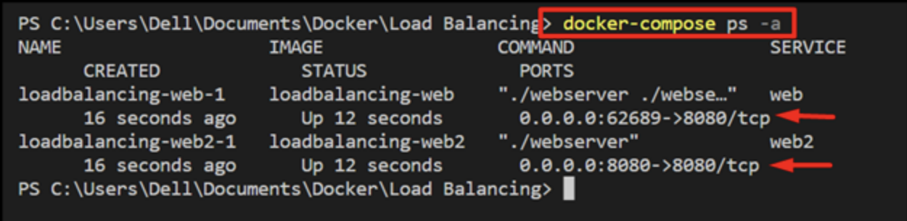
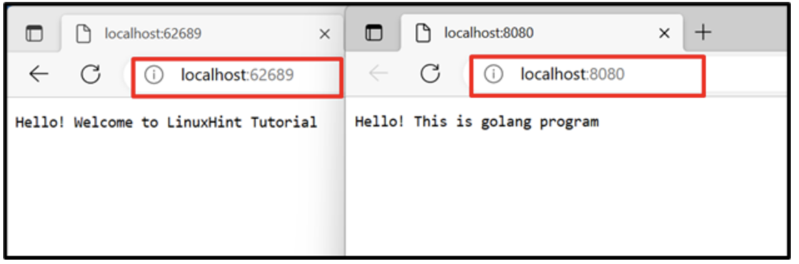
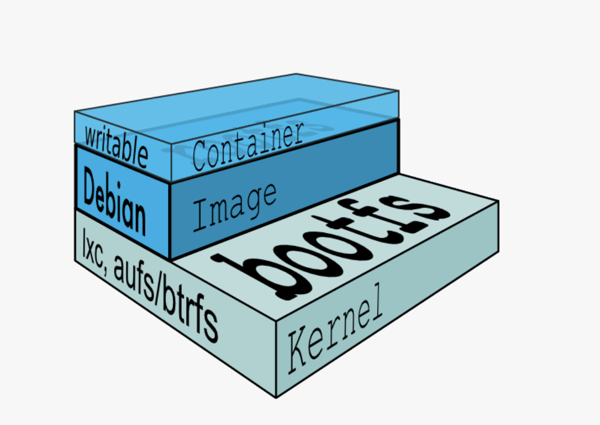

# Docker Primer <!-- omit from toc -->

## Contents <!-- omit from toc -->

- [Brief Intro to Docker](#brief-intro-to-docker)
- [Install Docker](#install-docker)
- [Docker Commands](#docker-commands)
- [Dockerfile Example](#dockerfile-example)
- [Docker Run and Docker Compose](#docker-run-and-docker-compose)
  - [Docker Run](#docker-run)
  - [Docker Compose](#docker-compose)
- [Docker Bind Mounts and Volumes](#docker-bind-mounts-and-volumes)
  - [Introduction to Docker Bind Mounts and Volumes](#introduction-to-docker-bind-mounts-and-volumes)
  - [Bind Mounts](#bind-mounts)
  - [Volumes](#volumes)
- [Docker Base Images](#docker-base-images)
  - [Node and Python Images](#node-and-python-images)
  - [Differences Between Standard Docker Images](#differences-between-standard-docker-images)
  - [Choosing the Right Python Docker Image: Slim Buster vs. Alpine vs. Slim Bullseye](#choosing-the-right-python-docker-image-slim-buster-vs-alpine-vs-slim-bullseye)
  - [Differences between Debian and Debian-Slim?](#differences-between-debian-and-debian-slim)

# Brief Intro to Docker

Introduction to Docker in the FastAPI with Docker
https://medium.com/@alidu143/containerizing-fastapi-app-with-docker-a-comprehensive-guide-416521b2457c

- **Docker Daemon**: The Docker Daemon is a background service that runs on the host machine and manages the lifecycle of containers. It listens to the Docker API requests and handles container operations such as starting, stopping, and monitoring containers.
- **Containerd**: Containerd is a lightweight container runtime that manages the low-level container operations, including image handling, container execution, and storage.
  Docker CLI: The Docker Command Line Interface (CLI) is a command-line tool used to interact with Docker. It provides a set of commands to manage Docker images, containers, networks, volumes, and other Docker resources.
- **Docker Images**: A Docker image is a read-only template that contains all the dependencies, configuration, and code required to run a Docker container. Images are built using a Dockerfile, which defines the instructions to create the image. Images are stored in a registry, such as Docker Hub or a private registry, and can be pulled and run on any Docker-compatible system.
- **Docker Containers**: A Docker container is a running instance of a Docker image. Containers are isolated environments that encapsulate the application and its dependencies, ensuring consistent behavior across different environments. Each container runs as an isolated process and has its own filesystem, networking, and process space.
- **Docker Registry**: A Docker registry is a repository that stores Docker images. The most commonly used registry is Docker Hub, which is a public registry that hosts a vast collection of Docker images. You can also set up private registries to store your custom Docker images securely.

# Install Docker

On your mac install or upgrade docker with

```sh
$ brew install docker
$ # or
$ brew upgrade docker
```

# Docker Commands

Stackoverflow
https://stackoverflow.com/questions/33907835/docker-error-cannot-delete-docker-container-conflict-unable-to-remove-reposito

Primer commands extended from the StackOverflow response.

```
Images vs. Container
There is a difference between docker images and docker containers. Check this SO Question.

In short, a container is a runnable instance of an image. which is why you cannot delete an image if there is a running container from that image. You just need to delete the container first.

docker ps -a                # Lists containers (and tells you which images they are spun from)

docker images               # Lists images

dockder container ls        # list containners

docker rm <container_id>    # Removes a stopped container

docker rm -f <container_id> # Forces the removal of a running container (uses SIGKILL)

docker rmi <image_id>       # Removes an image
                            # Will fail if there is a running instance of that image i.e. container

docker rmi -f <image_id>    # Forces removal of image even if it is referenced in multiple repositories,
                            # i.e. same image id given multiple names/tags
                            # Will still fail if there is a docker container referencing image

docker stop [OPTIONS] CONTAINER [CONTAINER...] Y

docker image prune -a --all # remove all images

docker system prune -a      # remove everything

docker container ls -a      # list containers including terminated
docker image ls             # list images
docker container rm <container_id>  # remove a container
docker image rm <image_id>   # remove an image

docker system prune -a      # remove everything

docker rename CONTAINER NEW_NAME
```

# Dockerfile Example

```
# For more information, please refer to https://aka.ms/vscode-docker-python
FROM python:3.10-slim

# expose a port
EXPOSE 5002

# Keeps Python from generating .pyc files in the container
ENV PYTHONDONTWRITEBYTECODE=1

# Turns off buffering for easier container logging
ENV PYTHONUNBUFFERED=1

# Install pip requirements
COPY requirements.txt .
RUN python -m pip install -r requirements.txt

WORKDIR /app
COPY . /app

# Creates a non-root user with an explicit UID and adds permission to access the /app folder
# For more info, please refer to https://aka.ms/vscode-docker-python-configure-containers
RUN adduser -u 5678 --disabled-password --gecos "" appuser && chown -R appuser /app
USER appuser

# During debugging, this entry point will be overridden. For more information, please refer to https://aka.ms/vscode-docker-python-debug
CMD ["gunicorn", "--bind", "0.0.0.0:5002", "server:app"]


```

# Docker Run and Docker Compose

https://linuxhint.com/docker-run-vs-docker-compose/

The “docker-compose” and “docker run” commands are executed to create and run the containers. The key difference is the “docker run” command creates a single container. However, “docker-compose” can create, manage and run multiple containers simultaneously.

## Docker Run

https://linuxhint.com/docker-run-vs-docker-compose/

Both “docker run” and “docker-compose” commands are used for a similar purpose to build and fire up the containers to containerize the application or services. The primary difference between these two commands is that the “docker run” command is a purely terminal-based command that executes the image to create a single container.

**Docker Run**

**Step 1:** Make a Docker File

Dockerfile

```
FROM golang:1.8
WORKDIR /go/src/app
COPY main1.go .
RUN go build -o webserver .
ENTRYPOINT ["./webserver"]
```

**Step 2** Create an image with the docker build command

docker build -t go-image -f main1.dockerfile .

**Step 3:** Create and Start the container

docker run -d -p 8080:8080 go-image

`-d` flag will execute the container in detached mode (i.e., background), and

`-p` specifies map host port 8080 to container port 8080

**Step 3:** List all Containers

docker ps -a

**Step 4:** Visit the assigned port
Visit the assigned port of the local host to check if the container is running or not:

in browser

```
localhost:8080
```

## Docker Compose

https://linuxhint.com/docker-run-vs-docker-compose/

The “docker-compose” command reads instructions from the “docker-compose.yml” file and is used to manage and run multi-container applications. In other words, it can create and execute more than one container at a time

**Example**

**Step 1:** Create “docker-compose.yml” File
First, create a file named “docker-compose.yml” file and configure the services required to execute. For instance, we have configured the following configurations:

**“services**”\*\* - configure two different services, “web” and “web2”.

The **“web”** service uses the “main.dockerfile” to containerize and run the “main.go” program.

The **“web2”** service uses the “main1.dockerfile” to dockerize and execute the “main1.go” program.

**“ports”** key is utilized to specify the exposing port for the container. In our scenario, Docker will automatically
assign the exposing port to the “web” service, and the **“web2”** service will expose on port 8080:

docker-compose.yml

```
version: "alpine"
services:
  web:
    build:
     dockerfile: main.dockerfile
    command: ["./webserver"]
    ports:
      - 8080

  web2:
    build:
     dockerfile: main1.dockerfile
    ports:
      - 8080:8080
```

**Step 2:** Start Containers

```
docker-compose up -d
```

**Step 3:** List the Containers

Here, you can see “web” is executing on port “62689” and “web2” is exposing on “8080”:



Step 4: navigate the exposing ports of containers for verification:



# Docker Bind Mounts and Volumes

## Introduction to Docker Bind Mounts and Volumes

by Matt McElreath
https://4sysops.com/archives/introduction-to-docker-bind-mounts-and-volumes/

By design, Docker containers do not store persistent data. Any data written to a container's writable layer will no longer be available once the container stops running. Also, getting data written to a container back out of it for another process can be difficult. To solve the issue of persisting data from a container, Docker has two options.

Bind mounts: A bind mount is a file or folder stored anywhere on the container host filesystem, mounted into a running container. The main difference a bind mount has from a volume is that since it can exist anywhere on the host filesystem, processes outside of Docker can also modify it.

Volumes: Volumes are the preferred way to store persistent data Docker containers create or use. The host filesystem also stores volumes, similar to bind mounts. However, Docker completely manages them and stores them under C:\ProgramData\docker\volumes by default.

## Bind Mounts

Originally, the only way to mount a _bind_ mount to a container was to use the _-v_ or _--volume_ flag as follows. The first part (before the colon) specifies the location on the host file system, and the second part (after the colon) identifies the location within the container.

```
docker run –it --name bindmount -v c:\data:c:\shareddata microsoft/windowsservercore powershell
```

Docker 17.06 introduced the _--mount_ flag for standalone containers. Docker recommends using _--mount_ flag in favor of _-v_ because _--mount_ is more explicit and easier to use.

```
docker run -it --name bindmount --mount type=bind,source=c:\data,target=c:\shareddata microsoft/windowsservercore powershell
```

Notice the --mount flag uses key–value pairs separated by commas to specify the mount settings for this container, making it easier to see exactly what they're configuring.

When using the _‑‑mount_ flag, the source folder must already exist on the container host. When using -v, if the directory does not exist, the command will create it automatically. If the directory does not exist when using _‑‑mount_, Docker with throw an error.

Specifying _-it_ in my docker run command will drop me into a PowerShell prompt on my running container. Running a directory listing on the C:\ drive within the new container shows that I have a folder called shareddata.

## Volumes

Let's start with creating a new volume. I'm going to go ahead and create one called logdata.

```
docker volume create logdata
```

Similar to the bind mount, we can use the --mount flag to specify a volume to mount to a new container called volume1.

```
docker run -it --name volume1 --mount type=volume,source=logdata,target=c:\logdata microsoft/windowsservercore powershell
```

From inside my new container, I should now see a folder on the C:\ drive called logdata, which currently has no data in it.

# Docker Base Images

Docker works through application of layers that are added to the base image. Since Docker uses a Union File System, the processes think the whole file system is mounted read-write. But all the changes go to the top-most writable layer, and underneath, the original file in the read-only image is unchanged.

## Node and Python Images



Stackoverflow Base Images  
https://stackoverflow.com/questions/20274162/why-do-you-need-a-base-image-with-docker

You may use any flavor of base image whatever is your host.

Python Base IMages

- Docker Python base images - https://hub.docker.com/_/python, accessed January 27, 2024

Node Base Images

- Docker Node base images - https://hub.docker.com/_/node/, accessed January 27, 2024

## Differences Between Standard Docker Images

https://forums.docker.com/t/differences-between-standard-docker-images-and-alpine-slim-versions/134973

**Alpine Linux** Docker Image: Alpine Linux is a lightweight Linux distribution that is designed to be small and secure. Alpine-based Docker images are typically much smaller than standard images, as they include only the bare essentials needed to run the application.

**Slim** Docker Image: These images are similar to Alpine-based images in that they are designed to be small and efficient. However, they are not necessarily based on Alpine Linux and can use other lightweight Linux distributions like CentOS or Debian. Slim images typically include only the necessary packages and dependencies to run the application, but may still be larger than Alpine-based images.

## Choosing the Right Python Docker Image: Slim Buster vs. Alpine vs. Slim Bullseye

https://medium.com/@arif.rahman.rhm/choosing-the-right-python-docker-image-slim-buster-vs-alpine-vs-slim-bullseye-5586bac8b4c9

**Size**

- Slim Buster: Weighing in at around 120MB, Slim Buster is larger than its contenders due to its Debian Buster base. However, it offers broader compatibility with libraries.

- Alpine: The champion of compact images, Alpine shines with its minimal footprint of around 50MB. Its Alpine Linux base prioritizes security and size over compatibility, though.

- Slim Bullseye: Striking a balance between size and compatibility, Slim Bullseye sits at around 80MB. It uses the newer Debian Bullseye base, offering access to updated software but slightly increasing the size compared to Alpine

**Compatibility**

- Slim Buster: Built on the widely used Debian Buster, Slim Buster boasts excellent compatibility with most Python libraries. You’re less likely to encounter unexpected compatibility issues here.

- Alpine: While smaller, Alpine’s reliance on musl libc can lead to compatibility issues with libraries heavily dependent on the standard glibc found in most other Linux distributions. Be prepared for troubleshooting potential conflicts.

- Slim Bullseye: Occupying a middle ground, Slim Bullseye offers better compatibility than Alpine due to its Debian base but might still face occasional issues with libraries specifically requiring older glibc versions.

**Security**

- Alpine: Alpine takes the security crown with its minimal attack surface and frequent updates. Its small size reduces vulnerabilities and exposes less code to potential attackers.

- Slim Buster: While not as focused on security as Alpine, Slim Buster still benefits from Debian’s robust security infrastructure and regular updates.

- Slim Bullseye: Similar to Slim Buster, Slim Bullseye leverages Debian’s security measures but inherits its slightly larger attack surface compared to Alpine.

## Differences between Debian and Debian-Slim?

You can compare the git repos used to build the images (rootfs.manifest is useful). Or you can run each image and see what they show is different:

```sh
$ docker run --rm debian:stable dpkg --get-selections >debian-stable-pkgs.txt

$ docker run --rm debian:stable-slim dpkg --get-selections >debian-stable-slim-pkgs.txt

$ diff debian-stable-pkgs.txt debian-stable-slim-pkgs.txt
```
